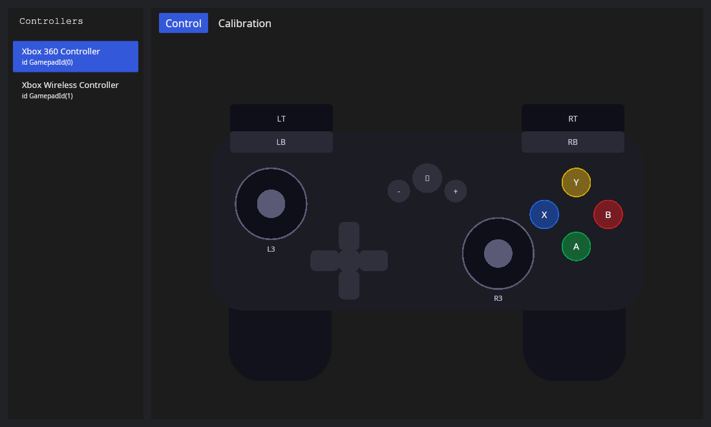
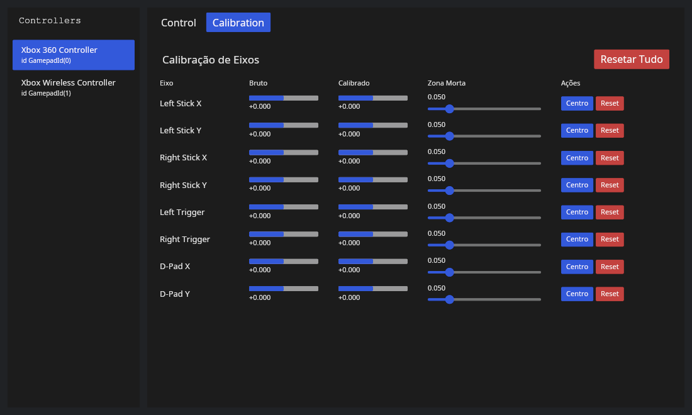

# Gamepad

## Description

Desktop application for monitoring and testing gamepads/controllers. Provides a list of connected devices, live visualization of axes and buttons, and calibration tools.

<table>
  <tr>
    <td></td>
    <td></td>
  </tr>
</table>

## Requirements

- Rust (stable) and `cargo`

## Building

To build in debug mode:

```bash
cargo build
```

To build in release mode:

```bash
cargo build --release
```

## Running

Run in development with `cargo run`:

```bash
cargo run
```

## Install icon and desktop entry

This repository includes `assets/gamepad.png` and `assets/gamepad.desktop` at the project root. To install the icon and desktop entry for the current user:

```bash
mkdir -p ~/.local/share/icons/hicolor/256x256/apps
cp assets/gamepad.png ~/.local/share/icons/hicolor/256x256/apps/gamepad.png
cp assets/gamepad.desktop ~/.local/share/applications/
update-desktop-database ~/.local/share/applications/ || true
```

Note: you can edit `gamepad.desktop` to adjust the `Exec=` path (for example `/usr/bin/gamepad`) and `Icon=` if you prefer different paths.

## Usage

- Connect a gamepad via USB or Bluetooth.
- Open the app and select the device from the list.
- Use the visualization to test buttons and axes, and run calibration when needed.

## Contributing

Contributions are welcome — please open issues or pull requests. Keep code consistent with project conventions and add tests when applicable.
